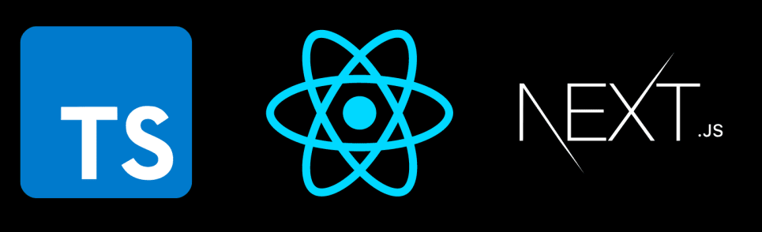

# Next JS - Full stack web application with Next.js, TypeScript and GraphQL

March 2021

> 🔨  From udemy: [Strongly Typed Next.js - Michael Stromer](https://www.udemy.com/course/strongly-typed-next-js/)

* * *

Next.js offers some serious performance improvements over the standard React web application. Here we will be using Next.js for:

- [Routing Pages](https://nextjs.org/docs/routing/introduction)
- [Data fetching](https://nextjs.org/docs/basic-features/data-fetching)
- [Typescript Support](https://nextjs.org/docs/basic-features/typescript)

## Section 1: Next.js

1. Create a Next.js web application with TypeScript
2. Include custom fonts and styles in our web app
3. Link pages using Next.js routing

- page/index.tsx: homepage for our website.
- page/about.tsx: page about.
- page/_app.tsx: handles global page props.
- page/_document.tsx: handles global styles.
- lib/theme.ts: custom light/dark modes theme.

## Section 2: TypeGraphQL

1. Create a GraphQL API schema with TypeGraphQL
2. Create a UserResolver for fetching user data

## Dependancies

[MATERIAL-UI](https://material-ui.com/): React components for faster and easier web development. Build your own design system, or start with Material Design.

`npm install @material-ui/core`

## Useful links

- [Strongly Typed Next.js](https://michaelstromer.nyc/books/strongly-typed-next-js/introduction)
- [MATERIAL-UI](https://material-ui.com/)
- [TypeGraphQL - Modern framework for GraphQL API in Node.js](https://typegraphql.com/)
- [typegoose - Define Mongoose models using TypeScript classes](https://typegoose.github.io/typegoose/)
- 
